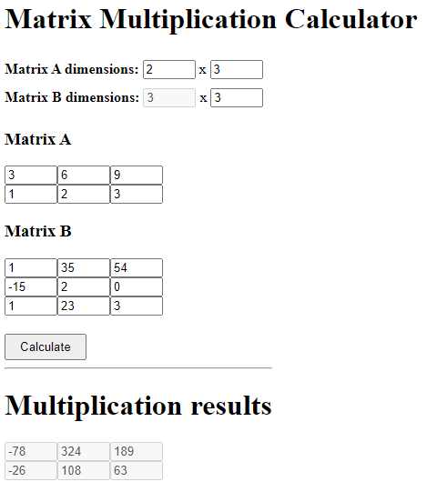

# Simple matrix multiplication

A basic matrix multiplication.
This is one of my university tasks.

# Features
- matrix multiplication
- dynamic drawing matrices

# Getting started
1. Clone this repo
``` 
git clone https://github.com/krzysztofhewelt/Simple-matrix-multiplication
```
2. Run index.html in your browser

# Used technologies
- HTML
- JavaScript
- CSS

# License
Distributed under the Apache License 2.0.
